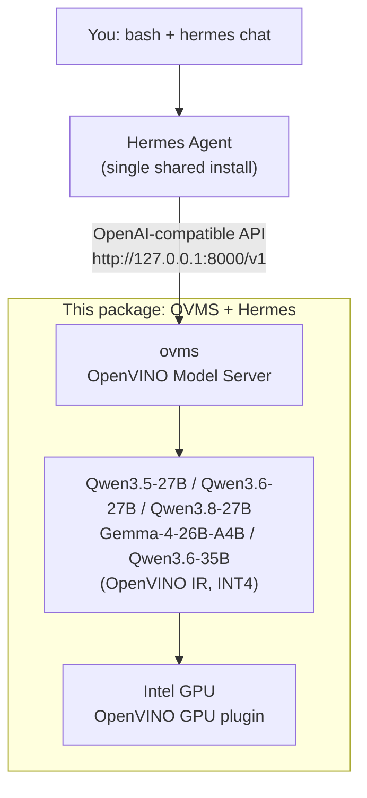

# Hermes + OVMS Local Workshop — Easy Installation (Linux)

This package prepares the complete local workshop environment automatically:



Participants do **not** manually download OVMS, configure Hermes, or run any model
download commands themselves.

## Requirements

- Linux x86_64 (Ubuntu 22.04/24.04 or compatible glibc-based distro)
- `python3` and `bash` available on `PATH` (present on virtually every distro by default)
- `curl` and `tar` available on `PATH`
- An Intel GPU with a current graphics driver (CPU also works, just slower)
- Internet access to GitHub and Hugging Face
- At least 40 GB of free disk space (the installer checks this before downloading)
- No root/administrator account is required

## Run the setup

1. Extract the entire easy-installation folder.
2. Open a terminal in the extracted folder and run:

```bash
./RUN_EASY_SETUP.sh
```

Alternatively, run the installer script directly:

```bash
bash ./install-ovms-local-workshop.sh
```

To pick a different model, pass `--model`:

```bash
./install-ovms-local-workshop.sh --model qwen3.6-27b
./install-ovms-local-workshop.sh --model qwen3.8-27b
./install-ovms-local-workshop.sh --model gemma4
./install-ovms-local-workshop.sh --model qwen3-35b
```

The default model is `qwen3.8-27b`. Model files are downloaded automatically on first
run and reused afterward.

The installer remembers the selected model for later restarts. To switch models later,
pass `--model` explicitly, for example `--model gemma4`; that selection is saved for
future restarts.

The installer also accepts these optional flags:

```text
--port <number>               Local port for the model server (default: 8000)
--wait-seconds <seconds>      Maximum time to wait for the model server (default: 2700)
--skip-hermes-install         Reuse and validate an existing Hermes installation
--do-not-start-server         Install and configure Hermes without starting OVMS
```

`--do-not-start-server` is useful when you want to install first and start the server
later with `start-ovms-local-workshop.sh`. When you pass `--port`, the installer starts
OVMS on that port and points Hermes at it for you.

## When setup reports `WORKSHOP READY`

The local model server is already running in the background and Hermes is configured.

## Check if OVMS is running

Before starting Hermes, open a **new** terminal and confirm the server actually
responds to a real prompt:

```bash
# Quick yes/no check: lists the currently loaded model
curl -s http://127.0.0.1:8000/v1/models
```

If OVMS is running, this returns JSON containing your model's name. If it fails with a
connection error, OVMS is not running — start it with `start-ovms-local-workshop.sh` (see
below).

```bash
# Send a real test prompt (~100+ tokens of reply) to prove inference actually works
curl -s http://127.0.0.1:8000/v1/chat/completions \
  -H "Content-Type: application/json" \
  -d '{"model": "Qwen3.8-27B-int4-ov", "max_tokens": 200, "temperature": 0, "stream": false, "messages": [{"role": "user", "content": "Why is the sky blue? Explain it in a way a curious 10-year-old would understand."}]}'
```

Replace `Qwen3.8-27B-int4-ov` with your actual model name if you started a different one
(check with the `/v1/models` command above).

```bash
# Check the port is actually being listened on
ss -ltn '( sport = :8000 )'
```

> **Note**: run these commands from any terminal — they work regardless of your
> current folder, since they just talk to `localhost:8000` over HTTP.

Once confirmed, start Hermes:

```bash
hermes
```

## Skills

Skills are reusable capabilities Hermes can install and load on demand. Try these three
with your local model — no cloud API keys needed for any of them.

> **Why a restart is needed**: Hermes builds its list of available skills when a session
> starts. Installing a skill while a session is already running won't make it usable in
> that same session — but you only need to restart **once**, not after every install. If
> you're already inside a Hermes chat, exit first (`Ctrl+C`) before running the install
> commands below.

Install all three official skills first, from a terminal (not from inside a Hermes chat):

```bash
hermes skills install official/creative/meme-generation
hermes skills install official/finance/stocks
hermes skills install official/creative/ascii-art
```

Now start (or restart) Hermes **once** — all three skills are available in this same
session:

```bash
hermes
```

### 1. Meme Generation

```text
/meme-generation Make a meme about: a woman shouting at a cat, saying "It's not your dinner!" — and the cat replying "It's just a snack."
```

### 2. Stock Comparison

```text
/stocks Compare the performance of AAPL, MSFT, INTC, and GOOGL.
```

### 3. ASCII Art QR Code

```text
/ascii-art Make a QR code for https://github.com/intel/AI-PC-Samples
```

Swap in your own repository URL if you'd rather generate a QR code for that instead.

## After restarting your machine

The model server is not installed as a systemd service. Start it again with:

```bash
cd "$HOME/OVMS-Local-Workshop/hermes-ovms-workshop-linux-x64-intel-v1.0.0"
./start-ovms-local-workshop.sh
hermes
```

To stop only the workshop model server:

```bash
./stop-ovms-local-workshop.sh
```

The start script supports additional options when needed:

```bash
# Force CPU or GPU instead of automatic device selection
./start-ovms-local-workshop.sh --target-device CPU
./start-ovms-local-workshop.sh --target-device GPU

# Use a different local port
./start-ovms-local-workshop.sh --port 8001
```

If you start the server on a non-default port this way, update Hermes to match it
(the installer's own `--port` flag does this for you):

```bash
hermes config set model.base_url "http://127.0.0.1:8001/v1"
```

## What the setup changes

- Resolves and downloads the latest OVMS Ubuntu 24.04 `python_on` release to
  `$HOME/OVMS-Local-Workshop/hermes-ovms-workshop-linux-x64-intel-v1.0.0/ovms`
- Installs the latest Hermes Agent build under `$HOME/.hermes` with the `hermes`
  command linked into `$HOME/.local/bin`
- Lets the official Hermes installer provision its private Python venv, Node.js,
  `uv`, and required packages
- Downloads and caches the selected model from Hugging Face on first run into the
  installed workshop's `models` folder (see
  [Where the model files are stored](#where-the-model-files-are-stored))
- Starts OVMS on `http://127.0.0.1:8000`
- Configures Hermes to use `http://127.0.0.1:8000/v1`

The endpoint is bound to `127.0.0.1`, so it is not exposed to other computers.
Installation logs are saved under the installed workshop's `logs` directory.

The installer also verifies the OVMS archive against the release's SHA-256 digest and
preserves an existing Hermes configuration before changing it. The start script
sets `LD_LIBRARY_PATH` and `PYTHONPATH` (pointing at the workshop's `ovms/lib`
folder, where the bundled shared libraries and Python packages live) only for
the launched server process so it never leaks into your shell, detects port
conflicts, and removes a stale `ovms` process left behind by an interrupted
startup.

Before downloading, the installer performs a non-blocking connectivity check for
GitHub, the Hermes installer host, and Hugging Face. The preflight is diagnostic
only: a proxy that rejects `HEAD`/`HEAD`-equivalent requests or an already-cached
offline rerun can still continue to the normal installer checks.

## Where the model files are stored

### Where is the OVMS server installed?

The OVMS server is installed at:

```text
$HOME/OVMS-Local-Workshop/hermes-ovms-workshop-linux-x64-intel-v1.0.0/ovms/bin/ovms
```

### Where are the models cached?

Downloaded model files are cached at:

```text
$HOME/OVMS-Local-Workshop/hermes-ovms-workshop-linux-x64-intel-v1.0.0/models
```

OVMS compilation files are cached in the sibling `.ovcache` directory.

Everything the workshop downloads stays inside one folder, so nothing is scattered
across your home directory:

```text
$HOME/OVMS-Local-Workshop/hermes-ovms-workshop-linux-x64-intel-v1.0.0/
├── models/      <- downloaded model weights (the big one: 5-20+ GB)
├── .ovcache/    <- compiled GPU kernels, rebuilt automatically if deleted
├── .state/      <- selected model and the running server's process ID
├── logs/        <- installation and model-server logs
└── ovms/        <- the OpenVINO Model Server program itself
```

OVMS downloads the model straight from Hugging Face into `models/`, so the weights are
**not** kept in a separate Hugging Face cache elsewhere on your machine. Deleting the
workshop folder removes the model files with it.

### Check what has been downloaded

```bash
workshop="$HOME/OVMS-Local-Workshop/hermes-ovms-workshop-linux-x64-intel-v1.0.0"

# Which model folders exist
ls -la "$workshop/models"

# How much disk space the models are using
du -sh "$workshop/models"
```

To ask OVMS itself which models it can serve from that folder:

```bash
# LD_LIBRARY_PATH and PYTHONPATH are required so ovms can find its bundled
# shared libraries and Python packages
LD_LIBRARY_PATH="$workshop/ovms/lib" PYTHONPATH="$workshop/ovms/lib/python" \
  "$workshop/ovms/bin/ovms" --model_repository_path "$workshop/models" --list_models
```

That lists what is present on disk. To see which model is actually loaded and
answering requests right now, use the `/v1/models` check in
[Check if OVMS is running](#check-if-ovms-is-running).

### Freeing up the space again

Stop the server first, then delete the model folder. Re-running setup downloads it
again from scratch:

```bash
cd "$HOME/OVMS-Local-Workshop/hermes-ovms-workshop-linux-x64-intel-v1.0.0"
./stop-ovms-local-workshop.sh
rm -rf "./models"
```

## If setup stops

Read the red error message and the newest file in:

```text
$HOME/OVMS-Local-Workshop/hermes-ovms-workshop-linux-x64-intel-v1.0.0/logs
```

The script is safe to run again. Completed downloads and installation stages are
reused when valid.

### "LFS object download failed" / "Stream error in the HTTP/2 framing layer"

This means the model download was interrupted mid-file by the network, not a problem
with the workshop scripts. It's usually flaky Wi-Fi, or a corporate proxy/firewall
interfering with Hugging Face's HTTP/2 CDN. Already-downloaded files are cached, so
just re-run setup — it resumes on the failed file instead of starting over:

```bash
cd "$HOME/OVMS-Local-Workshop/hermes-ovms-workshop-linux-x64-intel-v1.0.0"
./start-ovms-local-workshop.sh
```

Partly downloaded files are held in the `models` folder as `.lfs_part` files next to
their final name, which is what lets the next attempt resume rather than restart.
Leave them in place.

The start script already disables Hugging Face's Xet transfer path for you, so there is
nothing extra to set before retrying. If the same file keeps failing, the transfer is
being blocked or throttled upstream rather than by the workshop scripts — try a
different network connection, or ask your IT contact whether `huggingface.co` and its
CDN endpoints are permitted through the proxy.

The installer also prints a preflight result for each external host before the
OVMS archive download. A failed preflight is a warning, not an automatic stop;
the detailed failure and the retry attempts are recorded in the installation
transcript under `logs`.

### "error while loading shared libraries: libxml2.so.2" on Ubuntu 26.04

Ubuntu 26.04 ships a newer libxml2 with a different soname (`libxml2.so.16`)
than the Ubuntu 24.04 build OVMS links against (`libxml2.so.2`), so `ovms`
fails to start. Symlink the newer library to the name `ovms` expects:

```bash
sudo ln -sf /usr/lib/x86_64-linux-gnu/libxml2.so.16 /usr/lib/x86_64-linux-gnu/libxml2.so.2
```

You may see harmless `no version information available` warnings from `ovms`
afterward; they don't affect functionality.
