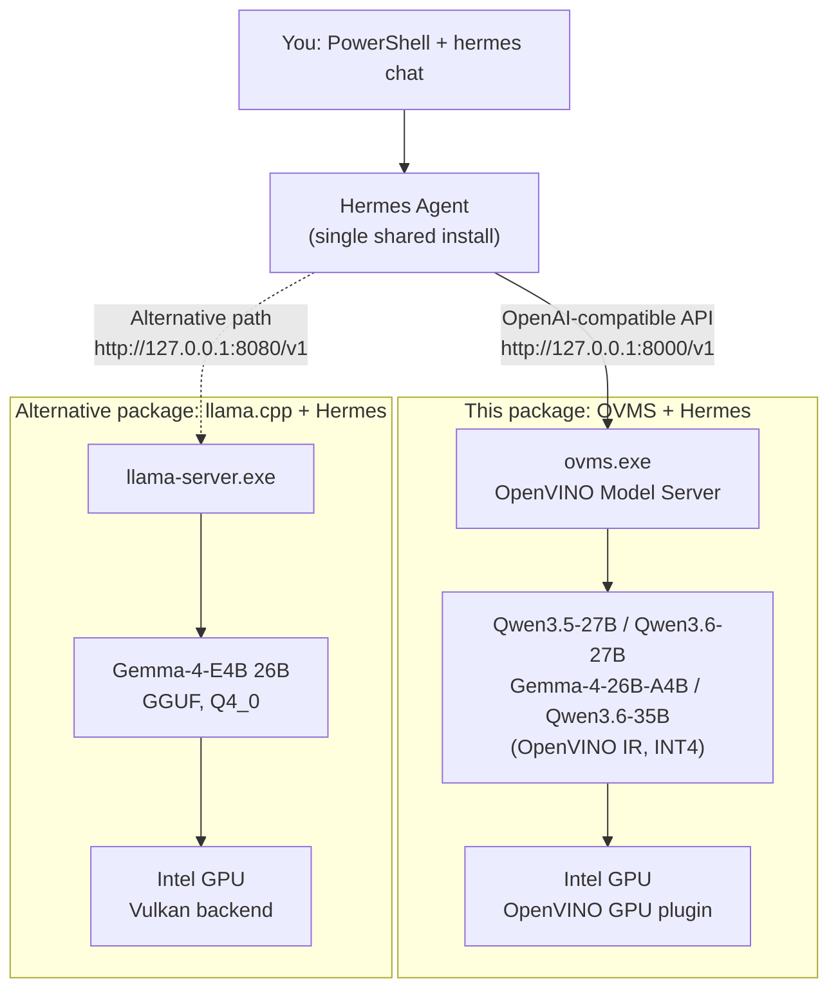

# Hermes + OVMS Local Workshop — Easy Installation

This package prepares the complete local workshop environment automatically:



Solid line = this package (OVMS). Dotted line = the separate llama.cpp + Gemma-4 workshop
package, an alternative backend for the same Hermes install — see
[Stop OVMS before running the llama.cpp workshop package](#stop-ovms-before-running-the-llamacpp-workshop-package)
if you plan to switch between them.

Participants do **not** manually download OVMS, configure Hermes, or run any model
download commands themselves.

## Requirements

- Windows 10 or Windows 11, 64-bit
- An Intel GPU with a current graphics driver (CPU also works, just slower)
- Internet access to GitHub and Hugging Face
- At least 40 GB of free disk space (the installer checks this before downloading)
- No administrator account is required

## Run the setup

1. Extract the entire easy-installation folder.
2. Double-click `RUN_EASY_SETUP.cmd`.
3. Leave the window open while OVMS downloads, the model downloads, and setup completes.

Alternatively, open PowerShell in the extracted folder and run:

```powershell
powershell.exe -NoProfile -ExecutionPolicy Bypass -File ".\Install-OVMSLocalWorkshop.ps1"
```

To pick a different model, pass `-Model`:

```powershell
powershell.exe -NoProfile -ExecutionPolicy Bypass -File ".\Install-OVMSLocalWorkshop.ps1" -Model qwen3.6-27b
powershell.exe -NoProfile -ExecutionPolicy Bypass -File ".\Install-OVMSLocalWorkshop.ps1" -Model gemma4
powershell.exe -NoProfile -ExecutionPolicy Bypass -File ".\Install-OVMSLocalWorkshop.ps1" -Model qwen3-35b
```

The default model is `qwen3.5-27b`. Model files are downloaded automatically on first
run and reused afterward.

The installer remembers the selected model for later restarts. To switch models later,
pass `-Model` explicitly, for example `-Model gemma4`; that selection is saved for
future restarts.

The installer also accepts these optional switches:

```text
-Port <number>               Local port for the model server (default: 8000)
-WaitSeconds <seconds>       Maximum time to wait for the model server (default: 2700)
-SkipHermesInstall           Reuse and validate an existing Hermes installation
-DoNotStartServer            Install and configure Hermes without starting OVMS
```

`-DoNotStartServer` is useful when you want to install first and start the server
later with `Start-OVMSLocalWorkshop.ps1`. When you pass `-Port`, the installer starts
OVMS on that port and points Hermes at it for you.

## When setup reports `WORKSHOP READY`

The local model server is already running in the background and Hermes is configured.

## Check if OVMS is running

Before starting Hermes, open a **new** PowerShell window and confirm the server actually
responds to a real prompt:

```powershell
# Quick yes/no check: lists the currently loaded model
Invoke-WebRequest -Uri "http://127.0.0.1:8000/v1/models" -UseBasicParsing | Select-Object -ExpandProperty Content
```

If OVMS is running, this returns JSON containing your model's name. If it fails with a
connection error, OVMS is not running — start it with `Start-OVMSLocalWorkshop.ps1` (see
below).

```powershell
# Send a real test prompt (~100+ tokens of reply) to prove inference actually works
Invoke-WebRequest -Uri "http://127.0.0.1:8000/v1/chat/completions" `
 -Method POST -UseBasicParsing `
 -Headers @{ "Content-Type" = "application/json" } `
 -Body '{"model": "Qwen3.5-27B-int4-ov", "max_tokens": 200, "temperature": 0, "stream": false, "messages": [{"role": "user", "content": "Why is the sky blue? Explain it in a way a curious 10-year-old would understand."}]}' |
 Select-Object -ExpandProperty Content
```

Replace `Qwen3.5-27B-int4-ov` with your actual model name if you started a different one
(check with the `/v1/models` command above).

```powershell
# Check the port is actually being listened on
Get-NetTCPConnection -LocalPort 8000 -State Listen -ErrorAction SilentlyContinue
```

> **Note**: run these commands from any PowerShell window — they work regardless of your
> current folder, since they just talk to `localhost:8000` over HTTP.

Once confirmed, start Hermes:

```powershell
hermes
```

## Skills

Skills are reusable capabilities Hermes can install and load on demand. Try these three
with your local model — no cloud API keys needed for any of them.

> **Why a restart is needed**: Hermes builds its list of available skills when a session
> starts. Installing a skill while a session is already running won't make it usable in
> that same session — but you only need to restart **once**, not after every install. If
> you're already inside a Hermes chat, exit first (`Ctrl+C`) before running the install
> commands below.

Install all three official skills first, from PowerShell (not from inside a Hermes chat):

```powershell
hermes skills install official/creative/meme-generation
hermes skills install official/finance/stocks
hermes skills install official/creative/ascii-art
```

Now start (or restart) Hermes **once** — all three skills are available in this same
session:

```powershell
hermes
```

### 1. Meme Generation

```text
/meme-generation Make a meme about: a woman shouting at a cat, saying "It's not your dinner!" — and the cat replying "It's just a snack."
```

### 2. Stock Comparison

```text
/stocks Compare the performance of AAPL, MSFT, INTC, and GOOGL.
```

### 3. ASCII Art QR Code

```text
/ascii-art Make a QR code for https://github.com/intel/AI-PC-Samples
```

Swap in your own repository URL if you'd rather generate a QR code for that instead.

## After restarting Windows

The model server is not installed as a Windows service. Start it again with:

```powershell
cd "$env:USERPROFILE\OVMS-Local-Workshop\hermes-ovms-workshop-windows-x64-intel-v1.0.0"
powershell.exe -NoProfile -ExecutionPolicy Bypass -File ".\Start-OVMSLocalWorkshop.ps1"
hermes
```

To stop only the workshop model server:

```powershell
powershell.exe -NoProfile -ExecutionPolicy Bypass -File ".\Stop-OVMSLocalWorkshop.ps1"
```

The start script supports additional options when needed:

```powershell
# Force CPU or GPU instead of automatic device selection
.\Start-OVMSLocalWorkshop.ps1 -TargetDevice CPU
.\Start-OVMSLocalWorkshop.ps1 -TargetDevice GPU

# Use a different local port
.\Start-OVMSLocalWorkshop.ps1 -Port 8001
```

If you start the server on a non-default port this way, update Hermes to match it
(the installer's own `-Port` switch does this for you):

```powershell
hermes config set model.base_url "http://127.0.0.1:8001/v1"
```

## Stop OVMS before running the llama.cpp workshop package

If you're switching to the separate llama.cpp + Gemma-4 workshop package on the same
laptop, stop OVMS first. Both packages install and share the **same** Hermes Agent, and
only one server can hold the Intel GPU / model memory at a time — leaving OVMS running
wastes GPU memory and Hermes will end up pointed at whichever one you set up last anyway.

```powershell
cd "$env:USERPROFILE\OVMS-Local-Workshop\hermes-ovms-workshop-windows-x64-intel-v1.0.0"
powershell.exe -NoProfile -ExecutionPolicy Bypass -File ".\Stop-OVMSLocalWorkshop.ps1"
```

Confirm it actually stopped before moving on:

```powershell
Get-NetTCPConnection -LocalPort 8000 -State Listen -ErrorAction SilentlyContinue
```

This should return nothing. Now you can safely run `RUN_EASY_SETUP.cmd` from the
llama.cpp workshop package — it will reconfigure Hermes to point at its own server on
port 8080 instead.

> To switch back to OVMS afterward without re-running the full installer, just start it
> again (`Start-OVMSLocalWorkshop.ps1`) and reconfigure Hermes:
> ```powershell
> hermes config set model.provider custom
> hermes config set model.base_url "http://127.0.0.1:8000/v1"
> hermes config set model.default "Qwen3.5-27B-int4-ov"
> ```
> (replace the model name with whichever one you actually started)

## What the setup changes

- Downloads and extracts OVMS 2026.3.1 to
  `%USERPROFILE%\OVMS-Local-Workshop\hermes-ovms-workshop-windows-x64-intel-v1.0.0\ovms`
- Installs the latest Hermes Agent build under `%LOCALAPPDATA%\hermes`
- Lets the official Hermes installer provision its private Python, Node.js,
  `uv`, Git, and required packages
- Downloads and caches the selected model from Hugging Face on first run into the
  installed workshop's `models` folder (see
  [Where the model files are stored](#where-the-model-files-are-stored))
- Starts OVMS on `http://127.0.0.1:8000`
- Configures Hermes to use `http://127.0.0.1:8000/v1`

The endpoint is bound to `127.0.0.1`, so it is not exposed to other computers.
Installation logs are saved under the installed workshop's `logs` directory.

The installer also verifies the OVMS archive against a pinned SHA-256 digest and
preserves an existing Hermes configuration before changing it. The start script
restores the caller's PowerShell environment after loading OVMS runtime variables,
detects port conflicts, and removes a stale OVMS process left behind by an
interrupted startup.

## Where the model files are stored

Everything the workshop downloads stays inside one folder, so nothing is scattered
across your user profile:

```text
%USERPROFILE%\OVMS-Local-Workshop\hermes-ovms-workshop-windows-x64-intel-v1.0.0\
├── models\      <- downloaded model weights (the big one: 5-20+ GB)
├── .ovcache\    <- compiled GPU kernels, rebuilt automatically if deleted
├── .state\      <- selected model and the running server's process ID
├── logs\        <- installation and model-server logs
└── ovms\        <- the OpenVINO Model Server program itself
```

OVMS downloads the model straight from Hugging Face into `models\`, so the weights are
**not** kept in a separate Hugging Face cache elsewhere on your machine. Deleting the
workshop folder removes the model files with it.

### Check what has been downloaded

```powershell
$workshop = "$env:USERPROFILE\OVMS-Local-Workshop\hermes-ovms-workshop-windows-x64-intel-v1.0.0"

# Which model folders exist
Get-ChildItem "$workshop\models" -Directory

# How much disk space the models are using
"{0:N1} GB" -f ((Get-ChildItem "$workshop\models" -Recurse -File |
    Measure-Object -Property Length -Sum).Sum / 1GB)
```

To ask OVMS itself which models it can serve from that folder:

```powershell
# Runs in a separate process so the OVMS runtime variables don't affect your session
powershell -NoProfile -Command "& '$workshop\ovms\setupvars.ps1' | Out-Null; & '$workshop\ovms\ovms.exe' --model_repository_path '$workshop\models' --list_models"
```

That lists what is present on disk. To see which model is actually loaded and
answering requests right now, use the `/v1/models` check in
[Check if OVMS is running](#check-if-ovms-is-running).

### Freeing up the space again

Stop the server first, then delete the model folder. Re-running setup downloads it
again from scratch:

```powershell
cd "$env:USERPROFILE\OVMS-Local-Workshop\hermes-ovms-workshop-windows-x64-intel-v1.0.0"
.\Stop-OVMSLocalWorkshop.ps1
Remove-Item ".\models" -Recurse -Force
```

## If setup stops

Read the red error message and the newest file in:

```text
%USERPROFILE%\OVMS-Local-Workshop\hermes-ovms-workshop-windows-x64-intel-v1.0.0\logs
```

The script is safe to run again. Completed downloads and installation stages are
reused when valid.

### "LFS object download failed" / "Stream error in the HTTP/2 framing layer"

This means the model download was interrupted mid-file by the network, not a problem
with the workshop scripts. It's usually flaky Wi-Fi, or a corporate proxy/firewall
interfering with Hugging Face's HTTP/2 CDN. Already-downloaded files are cached, so
just re-run setup — it resumes on the failed file instead of starting over:

```powershell
cd "$env:USERPROFILE\OVMS-Local-Workshop\hermes-ovms-workshop-windows-x64-intel-v1.0.0"
.\Start-OVMSLocalWorkshop.ps1
```

Partly downloaded files are held in the `models` folder as `.lfs_part` files next to
their final name, which is what lets the next attempt resume rather than restart.
Leave them in place.

The start script already disables Hugging Face's Xet transfer path for you, so there is
nothing extra to set before retrying. If the same file keeps failing, the transfer is
being blocked or throttled upstream rather than by the workshop scripts — try a
different network connection, or ask your IT contact whether `huggingface.co` and its
CDN endpoints are permitted through the proxy.
